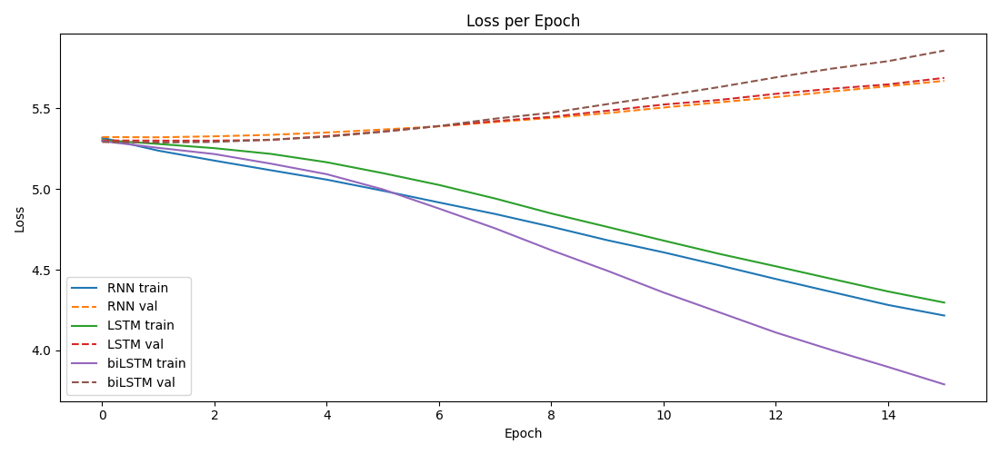
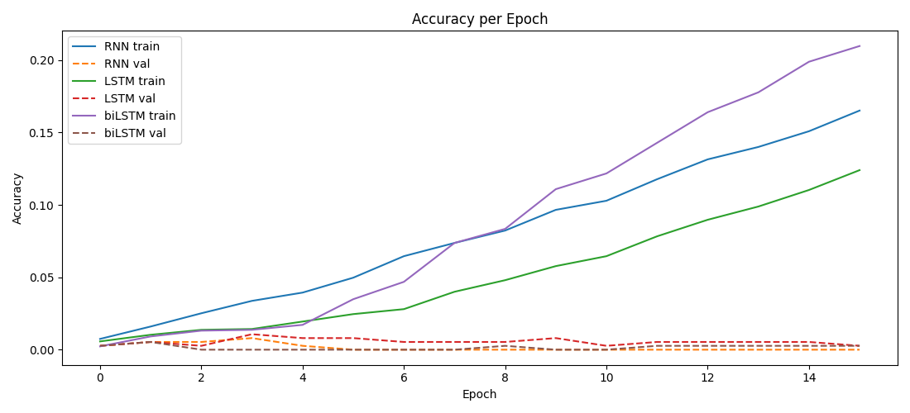
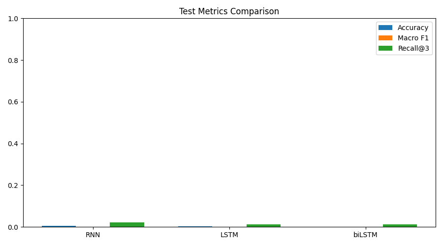
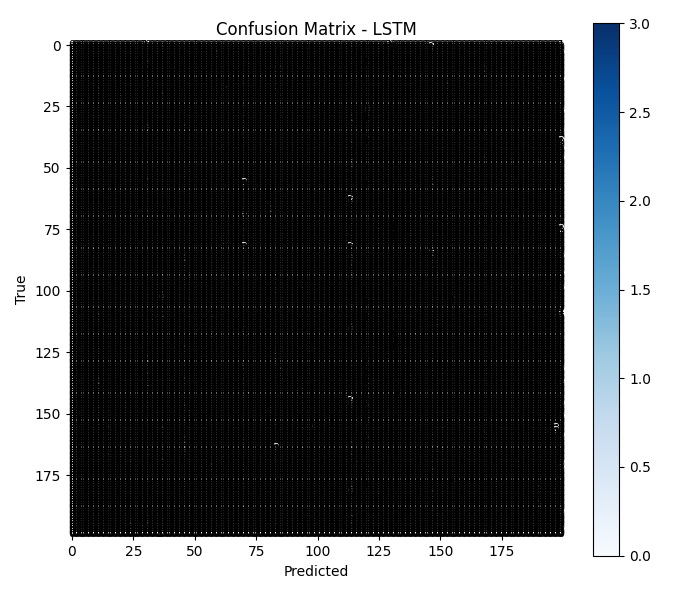
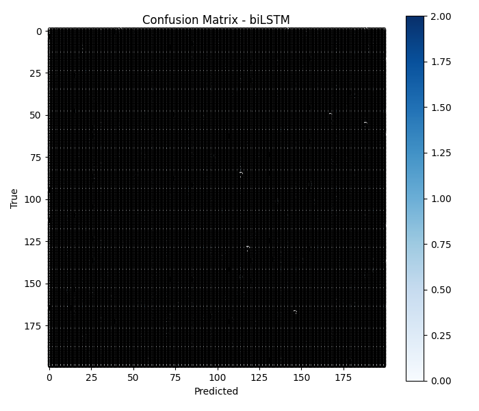

# Model Comparison Report

## Dataset & Config
- Rows: 4000
- Samples (sequence): 2500
- Products: 10
- Actions: 3
- Split train/val/test: 1750/375/375
- Epochs: 16, Batch size: 64, LR: 0.001, Seq len: 3

## Test Metrics

| Model | Accuracy | Macro F1 | Recall@3 | Loss |
|---|---:|---:|---:|---:|
| RNN | 0.1093 | 0.0944 | 0.3200 | 2.3593 |
| LSTM | 0.0933 | 0.0817 | 0.2667 | 2.3923 |
| biLSTM | 0.0853 | 0.0793 | 0.2240 | 2.3769 |

## Best Model
- model_best: **RNN**
- Reason: Highest test Macro F1 (tie-break by Recall@3, then Accuracy)
- Path: `D:\Kiến trúc và thiết kế phần mềm\AI-Ecommerce02\ai-service\training\models\rnn.pt`

## Visualizations

### 1) Loss Curves

### 2) Accuracy Curves

### 3) Metrics Bar Chart

### 4) Confusion Matrices

